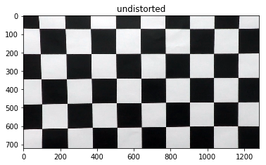

## Advanced Lane Finding

This is the fourth project of the Udacity SDC, which aims to write a software pipeline to detect lane lines given video streaming images. This porject invovled techniques like perspective transformation, sobel gradient and line regression. This readme file contains description and image for each stage of the pipeline.

The output videos are [Project Video](https://youtu.be/0V2vCmKacds) and [Challenge Video](https://youtu.be/wu3_AppdVoY).

The Project
---

The goals / steps of this project are the following:

* Compute the camera calibration matrix and distortion coefficients given a set of chessboard images.
* Apply a distortion correction to raw images.
* Use color transforms, gradients, etc., to create a thresholded binary image.
* Apply a perspective transform to rectify binary image ("birds-eye view").
* Detect lane pixels and fit to find the lane boundary.
* Determine the curvature of the lane and vehicle position with respect to center.
* Warp the detected lane boundaries back onto the original image.
* Output visual display of the lane boundaries and numerical estimation of lane curvature and vehicle position.

## Calibration
Images usually has problems of distortion because of the camera model we are using(the lens), the distortion will damage the shape of the real 3D objects in the 2D world. So we should remove the effects of distortion first to extract more useful information from images later.

We can use some chessboard images to help us do this job, together with functions provided by CV2. I create an calibration object to store the calibration matrix and do undistortion job.

Original                      |  Undistorted
:----------------------------:|:------------------------------:
| 

For real road image

Original                      |  Undistorted
:----------------------------:|:------------------------------:
|  

## Perspective Transformation

A perspective transform maps the points in a given image to different, desired, image points with a new perspective. Here we are using the birdeye transformation to get a view of the road from right above the road, this can be later used to calculate the curvature and find lines. 
After inspecting some of the sample images, I decide to use belowing 4 points to do the transformation.

(220, 720) | (580, 460)| (710, 460) |(1100, 720)
:---------:|:---------:|:----------:|:---------:

To do the transformation we should store the transform matrix and also the inverse transform matrix for later use.

## Image thresholding
We have to figure out points for left and right lines, so first we must filter out those points that have much relevant to the lane line. I tried different thresholding methods including x,y sobel gradient and color slector. In the implementation, the combination of color selector performed more robust than the combination of gradient thresholding, maybe it is caused by the parameter settings.

original |x gradeint |  y gradient | gradient magnitute | 
:----------------------------:|:------------------------------:|:------------------:|:---------------|
|   |  | 

graient ddirection |yellow  |  white | HLS | 
:----------------------------:|:------------------------------:|:------------------:|:---------------|
|   |  | 

Finally, I chose  to combine yellow, white and HLS selector to do the job.

Original    Thresh |  Warped Thresh
:----------------------------:|:------------------------------:
|  

## Line Finding and Fitting
Then we need to identify points in the birdside viewed binary image, this was down using a sliding window method. At each step, we identity points to left or right lanes respectivaly by sliding a fixed size window. After finding all points for left and right lines, then we are ready to fit a second order polynomial for each line, which can help us to predict the line position within the image. In the video pipeline, we can save our time to maintain former information, then we can narrow the serach region.

Window |  Fitted curve
:----------------------------:|:------------------------------:
|  

After this we have some visualization work, first we need to draw the area within two lines with color and then un-warped the colored image as the same view as original image. At last we need to combine original and processed line image to generate good output image.

Area |  Unwarped Area  | Combined Image
:----------------------------:|:------------------------------:|:---------------------:
|   |

To get more robust output for the video frame images, we can keep track on the last frames just saw and smoothing the output to get a robust version of detector, which can handle the situation where the lane line is not regular. Also, be careful that there are also some outliers, which means we have to check the new lines we found in each frame, it they are very different in curvature and very far away, then we may have an outlier and we should not use this line , but using the previous lines instead. In my implementation, I utilized a 15 frame memory and made the past poly contribute as much as the new plausible line.
