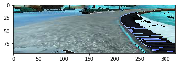

# Project 3: Use Deep Learning to Clone Driving Behavior
Overview
-----
This repository is for the third project of Udacity Self Driving Car, Driving Behavior Clone. In general, we will train a deep neural network to predict for the steering angle of the car given the center image within a video stream. For the training data, Udacity provides an excellent simulator, in which we can collect data for training and test our learned models.

This project is based on python and keras framework. 

Brief summary of this repository:
* `README.md` : document of this repository
* `model.h5` : store the final model for test, contains the structure and weights of the network trained
* `drive.py` : load stored model and send prediction to simulator
* `video.py` : create a video of images within one directory
* `model.py` : contains the model structure and training code
* `reader.py`  : contains the class and preprocessing of input images
* `src`: train notebook, just for reference
* `examples` : images for this readme file

Here are two demo videos of the car driving autonomously in the simulator on [track1](https://youtu.be/cHxQ6-M2bo0) and [track2](https://www.youtube.com/watch?v=0KUDThT8xf8&t=15s) using trained model.

## Dependencies
This lab requires:

* [CarND Term1 Starter Kit](https://github.com/udacity/CarND-Term1-Starter-Kit)

The lab enviroment can be created with CarND Term1 Starter Kit. Click [here](https://github.com/udacity/CarND-Term1-Starter-Kit/blob/master/README.md) for the details.

## Usage
For traing model, you need to create a directory, you can name it as 'data', which contains a driving log file and a directory contains all the images.
suppose the log's name is driving_log.csv
```sh
python model.py --log driving_log.csv --batch_size 256 --learning_rate 0.0001
```

For testing model, you can use the model here, model.h5, and use the drive.py provided by Udacity to test for real time simulation, also you need the simulator turned on.
```sh
python drive.py model.h5 run1
```

##Preprocessing

For behavioral cloning task, data plays an essential rule that it can directly influence the result of out model. First, we must ensure that the label for each data is correct, only in this way can the network learns something useful. For this particular project, it is natural to treat it as a regression problem (we may also transfer it to a classification problem). The data is a 2D RGB image, the label for that image data is the steering angle at the same timestamp. But, usually it is very hard to collect smooth steering angles because of the data collecting process, so one thing we can do to alleviate this is to do exponential smoothing for the training steer angles.


There a lot of thing we can do to deal with the input images. The original image shape is 320x160, but not all of them are useful for this project, we can safely drop the upper part of the image because for predicting steer angles, we are actually look at the lane and board of the road, the upper part usually contains sky and other noisy information, which are harmful for the training. The image after croppedis of size 100x320.

Left:  -0.0141                            |  Center   :-0.1641                              |  Right:-0.3141
:-------------------------------------:|:-----------------------------------------:|:-------------------------------------:
 | |

There are three cameras on the car for data collection, center left and right.Thus we have 3 images at the same time stamp, but we only have one steering angle at this time. Assume using center image as benchmark to the system,so one problem here is how get the accurate angles for left and right images. The best way to do this is using perspective transformation mentioned by NVIDIA's [End to End Learning for Self-Driving Cars](https://arxiv.org/pdf/1604.07316.pdf) and CMU's pioneering work on [
ALVINN, an autonomous land vehicle in a neural network](http://repository.cmu.edu/cgi/viewcontent.cgi?article=2874&context=compsci). But the accurate transformation need some parameters, like the distance between cameras and each camera's heading as well as the intrinsic parameters of the camera itself, which are all hard to collect for this simulator. But we can simply add some angles to left images and subtract the same amount for right images to approximate this transformation. By trial and error and small analysis, the `0.15` works pretty well for my implementation.

Left: -0.0141                       |  Center  :-0.1641 |  Right :-0.3141
:-------------------------------------:|:-----------------------------------------:|:-------------------------------------:
 | |

Inspired by the idea that we can get more samples by modifying images and get the correspoding steering angles, the flip operation is another simple way to augment dataset. We assume the horizontally flipped image has the opposite angles compared tp original angles. By saying opposite angle we simply means take negative of the origianl value.

Left: 0.0141            |  Center  :0.1641 |  Right : 0.3141
:-------------------------------------:|:-----------------------------------------:|:-------------------------------------:
 | |

I also resized the image to size 66x200, I just resized to fit to the network of Nvidia's work, I resize them to different sizes when testing other methods. Also we need to normalize the value of input image within the range `[0,1]`(didn't show this as images).

Left: 0.0141            |  Center  :0.1641 |  Right : 0.3141
:-------------------------------------:|:-----------------------------------------:|:-------------------------------------:
 | |

Note that data collected is unbalanced because much of time we are driving in a line, the 0 seems dominate the angle dataset. Training using the original dataset may be proned to predict for image with smaller angles compared to its true value, we need to modify the data set somehow. Here I randomly drop intervals which contains far more data than others.

 

All previous processing can be done on the disk or seperately from the training process. There are other random methods that can augment the training dataset during the training process. Data augmentation can be treated as a way of preprocessing only on training dataset, and it can greatly reduce the generalization error when applied correctly.


We can find that images has different light conditons, so we can randomly modify the brightness and contrast of the images each time we read them. I utilized two method, one is gamma adjustment, which can modify the brightness and contrast at the same time. Another way is to do modification is HSV color space and change brightness. 

Left                      |  Center                                   |  Right
:-------------------------------------:|:-----------------------------------------:|:-------------------------------------:
 | |

Left                       |  Center                                   |  Right
:-------------------------------------:|:-----------------------------------------:|:-------------------------------------:
 | |

In many application of computer vision, rotate and transformation is pretty useful. We want use them as well here, so the same problem mentioned before, how to change the angle correctly, the best way is perspective transformation, which is hard to implement and may also need the speed information(like when see image extreme, how long you want to recover back to the normal). But we can again approximate this, at last I chose +0.04 for horizontal shift to left per pixel and -0.04 for right shift. The vertical shift can be seen as hillside view. The approximation is really coarse, its error will be not acceptable with too large shift, so we must be careful with this. The correspoding angle for the image below is -0.2801.


## Model and Training

I tried several models, like those famous one, VGG16, Comma.ai's model and Nvidia's model VGG16's models seems too large for my dataset, it is likely to overfitting. After some trials, Nvidia's net works pretty well. I just added one additional layer at the begining, it's a 1x1 filter works like a color transformer, which can tranfer the color space of the input images. The network has 252231 parameters, which is large enough for our purpose, actually it is overfitting at first, so I add a dropout layer after every fully connected layer, which add a regulizer to out model and can force the model to has smaller generalization error. But we import another hyperparameter, the dropout layer, we have to careful with this, it can't too large or too small.


For the nonlinear activation, I chose the popular RELU, which can avoid some problems like gradient vanishing or exploding. There are more fancy activation function like Leaky Relu, but it didn't improve the model too much. I used for Adam optimizer for opmization, this is also a common used optimizer which can change its learning rate along each direction in the gradient, this also can alleviate our pain from choosing proper starting learning rate. I chose the 1e-4 and also add the learning rate schedule, hope this can improve the error performance. The metric is the simple MSE, but the MSE is not really the best way to quantifying our model's performance on the simulator. For example, we may have 99 angles near 0, only one with 1, you will get a very low mse, but the error occurs at the extreme angle will lead our car go off the road. So maybe we can assign more penalty on those points. Set the potential problem aside, we have another hyperparameter to choose, the training batch size and training epochs. Small batch size can offer regularizing effects due to the noise they add, but they lack stability because of the high variance when calculating the gradient, thus this requires a tradeoff, I chose 512 in my training. And I utilized the early stopping strategy to chose the epoces, but too much epoches is bad for real time simulation performance, I also add an upper bound 10 for number of epoches.

## Final Model Structrue

The model summarize in keras is:

|Layer (type)             |        Output Shape    |      Param #  |  Connected to |
|-------------------------|:----------------------:|:-------------:|:-------------:|
|image (InputLayer)       |    (None, 66, 200, 3)  |       0       | None          |                        
|color_layer (Convolution2D) |     (None, 66, 200, 3) |   12       |   image[0][0]  |                   
|conv2 (Convolution2D)            (None, 31, 98, 24) |   1824      |  color_layer[0][0]  |              
|conv3 (Convolution2D)   |        (None, 14, 47, 36) |   21636     |  conv2[0][0]         |           
|conv4 (Convolution2D)    |        (None, 5, 22, 48)  |   43248    |   conv3[0][0]         |             
|conv6 (Convolution2D)      |      (None, 1, 18, 64)  |   36928    |   conv5[0][0]         |             
|flatten_1 (Flatten)        |      (None, 1152)       |   0        |   conv6[0][0]         |             
|dense_1 (Dense)          |        (None, 100)       |    115300  |    flatten_1[0][0]    |              
|dropout_2 (Dropout)       |       (None, 100)        |   0        |   dense_1[0][0]       |             
|dense_2 (Dense)           |       (None, 50)         |   5050     |   dropout_2[0][0]     |             
|dropout_3 (Dropout)       |       (None, 50)         |   0        |   dense_2[0][0]       |             
|dense_3 (Dense)           |       (None, 10)         |   510      |   dropout_3[0][0]     |             
|dense_4 (Dense)           |       (None, 1)          |   11       |   dense_3[0][0]       |  

The total parameter is 252231. The first several CNN works as features extracter, and use followed fully connected struture to do nonlinear regression. 

The input data has 13403 cneter images and angles,  after augment left and right camera, together with flip operatiopn and filter for 0 angles, we have 45910 data in total. And I split the dataset into training and validation set, contains 41319 and 4591 seperately. And the validation MSE can get to around 0.0130 after 7-9 epoches. And the correspoding model can works well on first track, but it's not stable for second track for one really large turn on second track. This may due to my coarse approxiamtion and wrong driving input at data collection time.

## Future Work

One thing to is collect information of the cemera in order to get the accurate transformation of the steering angles to augment the dataset. We may also include the speed information into the model because at different speed, we will operate different for the same image input, because we have to estimate the outcome of one particular steering angle. 

The end to end model lack some kind of smoothness, because we assume each image is independent from each other, but this is not the real case. We can simply use exponential smoothing for the output angle. But the RNN is a better natural way to choose from, which take the former input along time axis as well to develop a time dependent model. 
