# Vehicle Detection

We are going to use traditional computer vison techniques to extract features from images and train a car classifier using those features. More advanced methods are using deep learing techniques like state-of-art Faster-RCNN, real time Yolo. The overall pipeline for our model is:
* Transfer images to different color space and extract color histogram and spatial features.
* Extract (Histogram of Oriented Gradients) HOG feature from the same color space images.
* Use labeled dataset to train a classifier, here we used linear SVC for accuracy and speed consideration.
* Slide windows through a image, for each frame image, predict the label for the window given trained model.
* For boxes(windows) detected as car, using a heatmap and a threshhold to zero out false positive.
* Store information for several frames and apply larger threshold for the consecutive video frames.
* Draw rectangles around detected labels.

Here is the link for the [project video](https://youtu.be/3eRGb3b30Fk).  You can run classify.ipynb to trian your own new classifer and use tracking.ipynb to test for your model and apply your pipeline on videos.

## Data Exploration
The images dataset for training classifier contians 8792 cars and the number of not cars is 8968, which is quite balanced, no more processing needed for balancing. The image is of size 64x64x3. Here are some examples of images:

car1             |  car2    | not_car1  | not_car2
:-------------------------:|:-------------------------:|:-----------:|:-----------:|
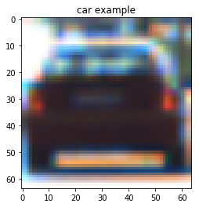  |  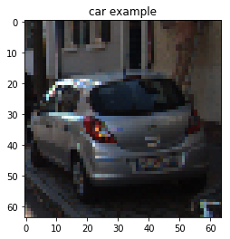| 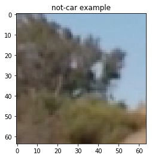 | 

## Features

### Color Features
For color features, we used spatial feature and color histogram in different color space.

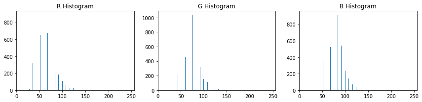   

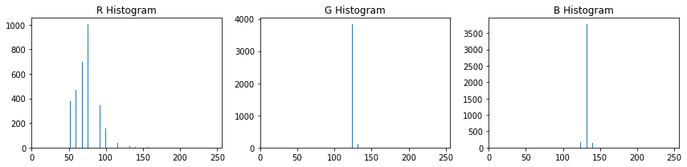

### HOG features
HOG features is very good for capturing the shape information of the image and it allows some kind of variation. Here are some features of HOG features map.

car1             |  car2    | 
:-------------------------:|:-------------------------:|
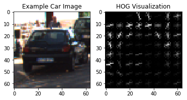  |  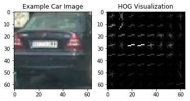|

not-car1             |  not-car2    | 
:-------------------------:|:-------------------------:|
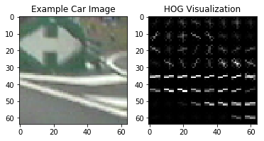  |  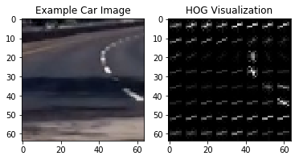|

It is very easy to tell apart the difference between these cars and not-cars shape information.

## Model Training

This is a classification problem with all continous inputs, so we can come up with Logistic Regression, support vector classification, neural network or tree methods. The input size is 64x64x3, which is a little bit large for logistic. And the tree methods lacking accuracy. Neural net is capable to capture all these information, but the training set is not that large for better tuning. So I used SVC as my final model, I also tried RBF kernel SVC, but it runs very slow in both traing and testing phase. The linear SVC can achieved fast and accurate. 

The linear SVC has little hyper-parameter to tune, just `C`, a penalty error. But there are many things we can change for the input data, such as color space, hist_bins and HOG cell size, etc. Thus I utilized grid search method to search through these parameter space, and used 5-folds cv scores as choosing metric. The final model is in YUV color space and use all channel HOG featrues, the hist_bin is 32, spatial size is (32,32). Using this parameters, I can get cv score of 0.9876.

## Slide Window
Now we have a classifier, which can classify an image into car or not car given sub-image of size 64x64x3. We have to figure out where the cars are in the image. Here we used the sliding window methods. In my implementation, I have a base square window of size 64x64, and then specify the staring and ending positions. We can get a list of windows of size 64x64 by moving base window in a specific step (16 pixels), and then we can feed all these windows to the classifier and get the prediction of the window. But the 64x64 is not the best size window, I also used multiple scales to detect different size cars. There is one thing to mention that, for larger scale, the seraching area is in lower part of the image, because larger cars are closer to the bottom. At last, I utilized 3 scales (1.2,1.4,1.7).

All sliding windows:

scale1.2            |  scale1.4    |  scale1.7 |
:-------------------------:|:-------------------------:|:--------:|
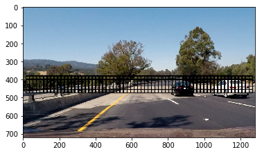  |  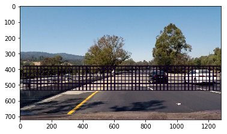| |

In my setting, there are 604 windows in total to search(this may be a little bit large, cause slower speed, but is robust one). Usually there are 6-7 windows classified as car for each true car in the image.

detected car1             |  detected car2    | 
:-------------------------:|:-------------------------:|
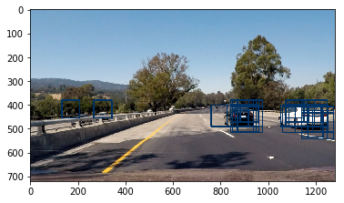  |  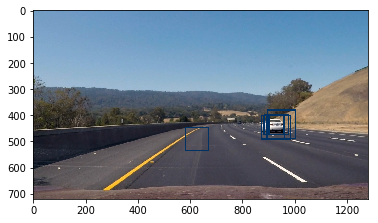|

It is obvious the classifier is not perfect, we have to filter out false positive one, one simple strategy is to maintain pixels classified to car above a threshhold as true car. We can achieve this by using heatmap counting and using label method to figure out how many cars, where they are and finally draw the boxes contains car on the image.

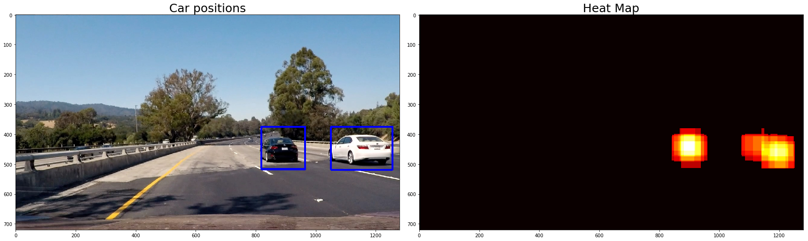  

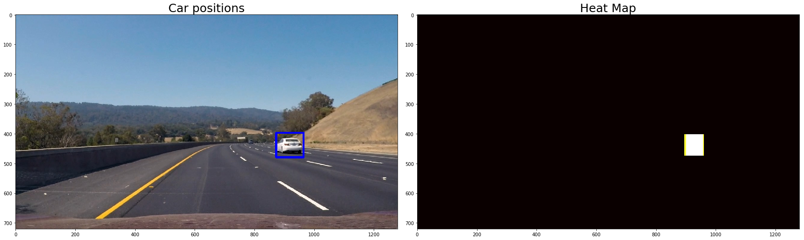

## Video Pipeline

For video images, we can keeo track of last few frames' information to get a robust result. Because a false positive boxes is probably not classified to wrong answer again, we can average several frames information, here I choose 9 frames, so I store 9 frames detected boxes and set a threshold for all of these boxes(here my setting is 9x2=18). Also I used a step multiple of size of cell size in HOG extraction, by doing so, I can only calculate HOG once and just extract sub-HOG from the whole feature at each search, this will reduce the running time. Below are 8 frame's position of car and corresponding heatmap, together with their average one.

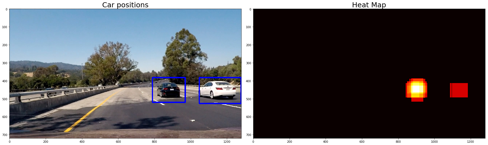 

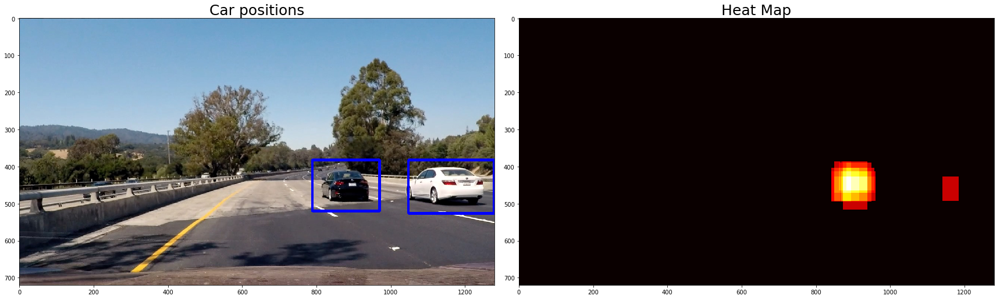 

 

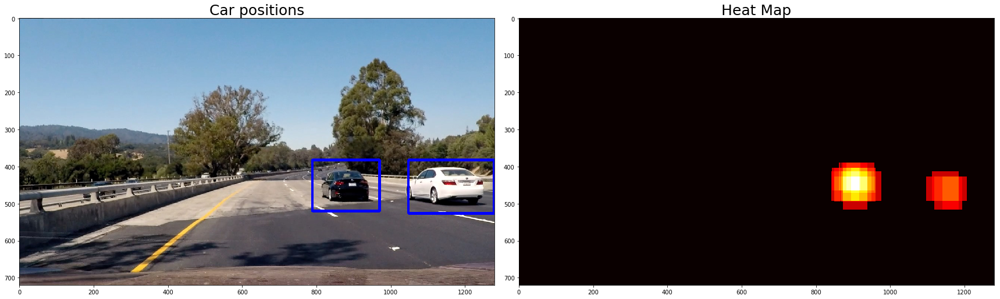

 

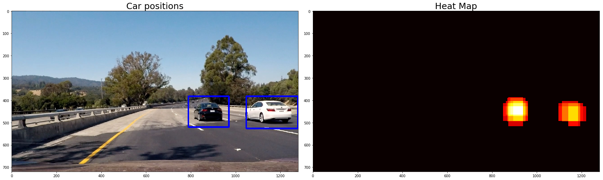

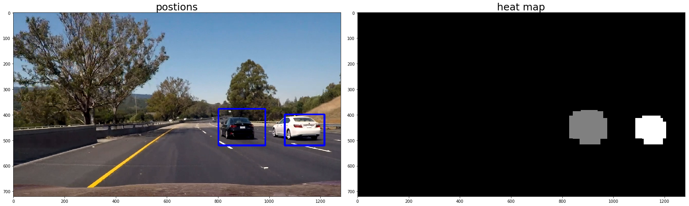

## Discussion
My implementation is a little bit slow at video test time, for that I search through too many windows in order to get a robust answer, which can filter out false positive. Also, the box detectd and pictured is not a perfect box, because those boxes contains the margin of the car is not likely to be classified as car, thus its count is less than the body of the car. Maybe I can use more frame and more dynamic update rule for boxes update and thresholding. Actually, the YOLO method is much better.
