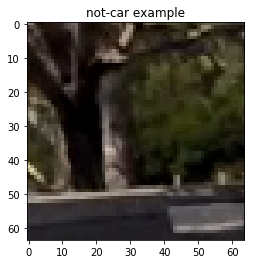

# Vehicle Detection

We are going to use traditional computer vison techniques to extract features from images and train a car classifier using those features. More advanced methods are using deep learing techniques like state-of-art Faster-RCNN, real time Yolo. The overall pipeline for our model is:
* Transfer images to different color space and extract color histogram and spatial features.
* Extract (Histogram of Oriented Gradients) HOG feature from the same color space images.
* Use labeled dataset to train a classifier, here we used linear SVC for accuracy and speed consideration.
* Slide windows through a image, for each frame image, predict the label for the window given trained model.
* For boxes(windows) detected as car, using a heatmap and a threshhold to zero out false positive.
* Store information for several frames and apply larger threshold for the consecutive video frames.
* Draw rectangles around detected labels.

Here are links for the [project video]()

## Data Exploration
The images dataset for training classifier contians 8792 cars and the number of not cars is 8968, which is quite balanced, no more processing needed for balancing. The image is of size 64x64x3. Here are some examples of images:

car1             |  car2    | not_car1  | not_car2
:-------------------------:|:-------------------------:|:-----------:|:-----------:|
  |  |  | 

## Features

### Color Features
For color features, we used spatial feature and color histogram in different color space.

   

### HOG features
HOG features is very good for capturing the shape information of the image and it allows some kind of variation. Here are some features of HOG features map.

car1             |  car2    | 
:-------------------------:|:-------------------------:|
  |  |

not-car1             |  not-car2    | 
:-------------------------:|:-------------------------:|
  |  |

It is very easy to tell apart the difference between these cars and not-cars shape information.

## Model Training

This is a classification problem with all continous inputs, so we can come up with Logistic Regression, support vector classification, neural network or tree methods. The input size is 64x64x3, which is a little bit large for logistic. And the tree methods lacking accuracy. Neural net is capable to capture all these information, but the training set is not that large for better tuning. So I used SVC as my final model, I also tried RBF kernel SVC, but it runs very slow in both traing and testing phase. The linear SVC can achieved fast and accurate. 

The linear SVC has little hyper-parameter to tune, just `C`, a penalty error. But there are many things we can change for the input data, such as color space, hist_bins and HOG cell size, etc. Thus I utilized grid search method to search through these parameter space, and used 5-folds cv scores as choosing metric. The final model is in YUV color space and use all channel HOG featrues, the hist_bin is 32, spatial size is (32,32). Using this parameters, I can get cv score of 0.9876.
